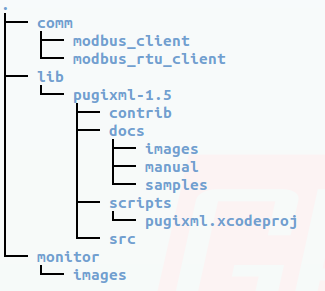

Prointegra Datalogger Community Edition, Monitor
========

Monitor is part of the software suite to retrieve data from industrial equipments, and export reports from them. developed by Prointegra SL.

The community edition is Free as in Freedom software.

##objective

Monitor is a modified pvbrowser server (from http://pvbrowser.de) for taking data from configured slaves (via MODBUS TCP or MODBUS RTU) and storing it to a database.
It takes care of the status of the database and communication, and should be capable of showing realtime information via pvbrowser.


##Dependencies


this program ha been developed under the pvbrowser suit, free software under the gpl2 license. it can be download for free at: www.pvbrowser.org.
it uses it's libraries. rllib, and pvserver.
monitor uses also QT4, mysql and pugixml.

##images license

./images/green.png

./images/grey.png

./images/red.png

have been taken from the pvbrowser examples.

Prointegra have them licensed under
CC-BY-SA
copyright 2012-2015 Prointegra S.L. , mail: jcuellar@prointegra.com

##Compile and installation

0.-we need pugixml installed, download it from http://pugixml.org/, and uncompres it under the lib folder.

0b.-we need communications daemons installed, download them from pvbrowser.de -> downloads -> additional -> pvbaddon. There are some daemons examples

0c.- the final folder tree, for example, should be like this:



1.-qmake

2.-make clean

3.-make

4.-It has one executable
monitor

5.-We'll have to compile the communication daemons too, also doing, qmake, make clean, make

##Contact

mail to: jcuellar (at) prointegra.com


##Changelog

**v0.1: (2015/03/27)**

*First version working in a real environment, with 4 PM800 measuring energy*

* (DEBUG): removed an acumulative time error sampling slaves

**v0.1rc2 unestable: (2015/03/20) FUNCTION TEST DURING WEEKEND**

* (DEBUG&IMPROVE): CSV file load to DATA_INDEX table of the database. Added new features as equipment, scale and units.
* (DEBUG)Monitor: now the sample time is adjusted: i.e: 20 seconds are 20 seconds in database (not 21)
* (IMPROVE)Monitor: added data type MOD10: (4 registers)
```
VAlue = (Register 4 x 1000000000000) + (Register 3 x 100000000) + (Register 2 x 10000) + Register 1.
```
* (DEBUG)Monitor: database variables as Float, not INT.

**v0.1rc1: (2015/03/19) START POINT**


* Comm: communications possible via Modbus TCP/IP & Modbus RTU
* Monitor: Check status of Comm daemons, capture storage configuration from xml file, and save data to db.

